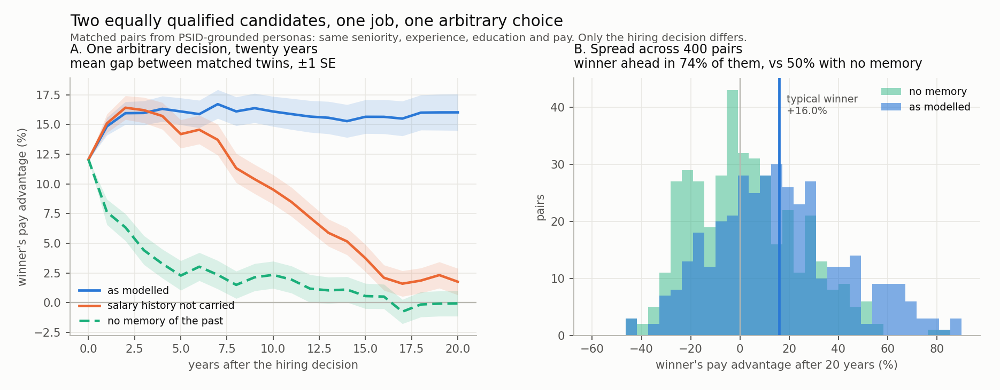

# Two equal candidates, one job, twenty years

A first pass at the question directly: *if two equally qualified people apply
for the same job and an LLM picks one, where are they in twenty years?*

Everything here runs with no API key. Nothing has been through a real LLM yet —
the hiring decision is currently a coin flip, which is the right stand-in for
the null case and the wrong one for the real question. More on that at the end.

---

## The design

The question can't be answered with two arbitrary people, because you can never
separate *he was hired because he was better* from *he is better off because he
was hired*. So the candidates are built as **matched pairs**.

Each pair is equivalent on every merit-relevant dimension and different on every
surface one:

| held equal | allowed to differ |
|---|---|
| seniority level | employer names |
| years of experience | city |
| degree level | school and field of study |
| number of positions | project details, every bullet |
| number of career breaks | name and email (inserted afterwards) |
| number of promotions | |
| current salary (within 2%) | |
| latent ability (identical) | |

The equivalence is **audited, not asserted** — `verify_pair` returns which
dimensions matched, and every pair shipped here passes. Sample pairs, with
their audit tables, are in `out/twin_pairs.md`.

Because there is nothing to choose between them, the choice is arbitrary by
construction. Whatever happens next is attributable to the decision.

## The experiment

Year 0: both apply for the same posting. One is hired — a 12% pay bump and a
step up in title. Years 1–20: both work, both apply for jobs, both are paid.
The only difference between them is who got that first job.

400 pairs, 20 years, winner alternating between twin A and twin B so the result
can't be an artefact of one twin being systematically different.

## The result

Reported as a distribution over **20 seeds × 400 pairs** (`replicate.py`),
because a single run moves by a point or two. Each seed rebuilds the pairs and
redraws the twenty years of noise.

**An advantage worth 12.1% on the day is worth 14.1% (± 1.3 across seeds)
twenty years later. The winner is ahead in 70% (± 2.5) of pairs.**

| channel switched off | gap at 20 yrs, mean ± sd | winner ahead | amplification |
|---|---|---|---|
| *(none — as modelled)* | **+14.1% ± 1.3** | **70% ± 2.5** | 1.16 ± 0.10 |
| salary anchoring | +2.0% ± 1.0 | 53% ± 2.6 | 0.17 ± 0.09 |
| title ladder | +10.7% ± 1.1 | 69% ± 1.9 | 0.89 ± 0.08 |
| wage compounding | +9.7% ± 1.2 | 65% ± 2.3 | 0.81 ± 0.10 |
| all three (+ no title step-up) | +0.0% ± 0.9 | 50% ± 2.1 | 0.00 ± 0.08 |

Per-seed *t* for the baseline gap is never below 8.9. Without anchoring, |*t*|
clears 2 in 10 of 20 seeds — a small residual carried by the ladder and
compounding, not a clean zero.

Three things worth drawing out.

**Salary anchoring carries about 85% of the mechanism.** Remove only that —
your current pay acting as a floor on your next offer — and the twenty-year gap
falls from 14% to 2%, and the winner-ahead share from 70% to 53%. The title
ladder and wage compounding each carry a quarter to a third of the effect, but
neither is necessary; anchoring nearly is.

That is a satisfying result partly because it is *checkable against the world*.
Salary-history bans are live policy in a number of US states, and this says the
mechanism they target is the one that does most of the work.

**The advantage persists and grows only a little.** Amplification is
1.16 ± 0.10 — the gap holds its initial size and drifts up modestly, and in 3
of 20 seeds it does not grow at all (min 0.95). So in the language of the
original README: **"winners stay winning" clearly; "winners extend their lead"
weakly, and not robustly.** Whether the lead *should* widen is a question about
salary slopes, taken up in `slope.py` and in `REPLY_TO_RICH.md`.

**The null behaves.** With all memory off the gap is 0.0% ± 0.9 and the winner
is ahead in 50% ± 2 — indistinguishable from zero, as it should be. That the
null lands on nothing is what makes the 70% believable.

**Which twin is "A" does not matter.** Across the 20 seeds the A-vs-B group gap
under the fair coin is −0.5% ± 1.1. Swapping the two twins' careers while
holding the noise streams fixed changes a run's headline by less than 0.1
points; swapping the noise streams while holding the careers fixed changes it
by 2–3 points. Differences between runs are Monte Carlo noise, not an A/B
asymmetry.



*The figure shows seed 0 (16.0%, 74%), which sits at the top of the 20-seed
range; the table above is the number to quote.*

> **Correction to an earlier circulated version (6 Sept)** — 12.5%, 69%, and "exactly
> 50.0%" without anchoring. They came from a run whose per-period noise was
> keyed on Python's `hash()` of a tuple containing a string. Python randomises
> string hashing per process, so the same command gave a different draw every
> time it was run. Fixed (`SeedSequence`); the 20-seed distribution above
> replaces the single-run point estimates. The qualitative claims survive;
> "exactly 50.0%" does not — it is 53% ± 2.6.

## What is not yet true

**No LLM has made any of these decisions.** The hiring choice is a coin flip.
That's the correct null and it isolates the compounding machinery cleanly, but
it is not the research question. The question is what happens when *an LLM*
chooses — and the interesting possibility is that it won't be a coin flip at
all.

That's the next run, and the twin design is what makes it interpretable: if a
model picks twin A over twin B systematically across many pairs, that is
measurement bias rather than cumulative advantage, and the two are separable
only because the pairs are matched. Both orderings need running for the same
reason.

**The channel strengths are parameters, not findings.** Anchoring is the whole
mechanism *given how strongly I set it*. It should be calibrated against real
wage data before anyone believes the magnitude.

**One occupation, one metro**, as in the FAccT appendix — software engineering
in the New York area.

## Open questions

1. **Should the branch be a real posting?** Right now the "job" is an abstract
   12% bump. It could instead be a specific posting from the ASEE set, which
   would make the LLM decision concrete and the counterfactual sharper.
2. **How strong should anchoring be?** It is currently the dominant channel by
   construction. PSID can discipline this.
3. **Twenty years, or career-time?** Twenty calendar years from a cohort aged
   25–44 puts some people past retirement.
4. **Does the model treat the twins as equal?** Testable now and cheap — a few
   hundred calls on the existing pairs would tell us whether the arbitrary
   choice really is arbitrary.

## Reproduce

```bash
python -m resumegen.show_pairs   --pairs 6                       # out/twin_pairs.md
python -m resumegen.divergence   --pairs 400 --years 20 --channels
python -m resumegen.plot_divergence                              # out/divergence.png
```
